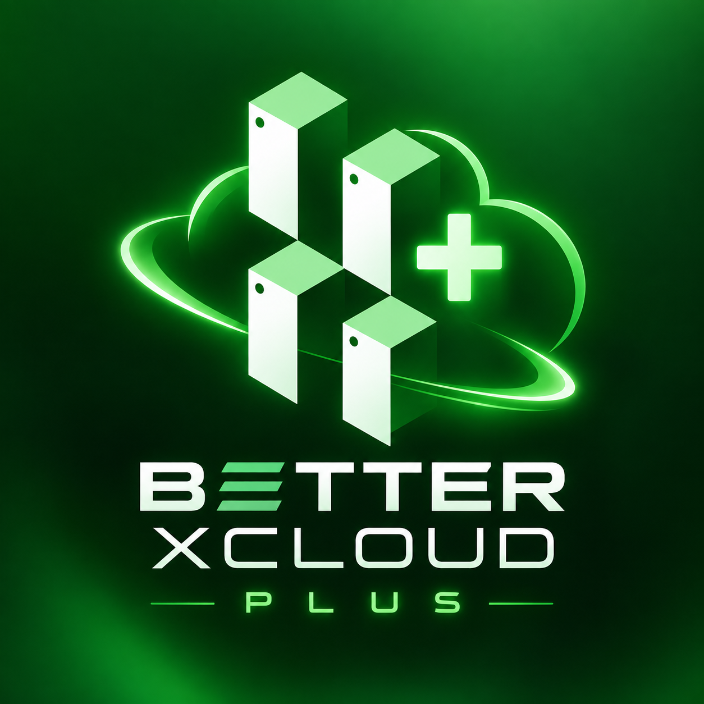

<p align="center">
  
</p>

# Better xCloud Plus

> [!WARNING]
> **Versão beta / em testes.** Este projeto ainda está em desenvolvimento e pode apresentar bugs visuais, recursos incompletos, mudanças frequentes ou incompatibilidades temporárias após atualizações do site Xbox. Use por sua conta e risco e mantenha o script atualizado.

**Better xCloud Plus** é um projeto brasileiro de personalização baseada no Better xCloud para o [Xbox Cloud Gaming](https://www.xbox.com/play). Ela reúne ajustes de interface, qualidade das artes do site, controles avançados de vídeo no navegador e ferramentas para adaptar a experiência ao seu computador, monitor e tipo de jogo.

O objetivo é deixar o Cloud Gaming mais agradável e configurável sem prometer alterações que dependem dos servidores da Microsoft.

## Destaques

- Personalização do hub: tamanho dos jogos, bordas, animações, efeito ao passar o mouse e transição ao abrir um jogo.
- Qualidade das capas, fundos e artes do site em até **100%**, quando a imagem original estiver disponível no servidor.
- Upscale visual local para a saída da tela, com modos VX, **AMD FSR 1** e **NVIDIA Image Scaling (NIS)**.
- Redução de artefatos, nitidez adaptativa, reconstrução de detalhes e reconstrução temporal experimentais.
- Perfis de configurações sugeridas para menor ou maior qualidade.
- Modo competitivo para priorizar menor latência, desativando temporariamente os efeitos visuais VX.
- Indicadores de stream com FPS e resolução de entrada/saída quando houver processamento visual ativo.
- Compatibilidade com Cloud Gaming e Reprodução Remota dentro do site Xbox.

## Limites importantes

O Better xCloud Plus roda no navegador, depois que o vídeo chega ao seu dispositivo. Portanto:

- Upscale melhora a apresentação local, mas **não transforma o stream em 4K nativo**.
- A opção de qualidade das imagens altera capas e fundos do site, não o vídeo do jogo.
- Não é possível forçar bitrate ilimitado, codec, resolução ou FPS enviados pelo servidor.
- Recursos de geração/interpolação de frames são experimentais, dependem de GPU e navegador e **não reduzem a latência dos comandos**.
- Resultados variam conforme monitor, GPU, rede, navegador e jogo.

## Instalação

### Links necessários

| Necessário | Link |
| --- | --- |
| Navegador recomendado | [Microsoft Edge](https://www.microsoft.com/edge/download) · [Google Chrome](https://www.google.com/chrome/) · [Mozilla Firefox](https://www.mozilla.org/firefox/new/) |
| Extensão para executar o script | [Tampermonkey](https://www.tampermonkey.net/) |
| Instalar/atualizar Better xCloud Plus | [Clique aqui para instalar o script](https://raw.githubusercontent.com/viniraus1-gif/Better-xCloud-Plus/main/dist/better-xcloud-plus.pretty.user.js) |
| Abrir o serviço | [Xbox Cloud Gaming](https://www.xbox.com/pt-BR/play) |
| Conta | [Entrar ou criar conta Microsoft](https://account.microsoft.com/) |

Você precisa de uma conta Microsoft e de acesso a um jogo disponível no Cloud Gaming — por assinatura compatível ou por compra, quando o jogo permitir transmissão própria.

### Passo a passo

1. Instale um dos navegadores indicados acima. O Edge é o recomendado para testar todos os recursos do xCloud.
2. Instale o [Tampermonkey](https://www.tampermonkey.net/) para o seu navegador.
3. Abra o link **[Clique aqui para instalar o script](https://raw.githubusercontent.com/viniraus1-gif/Better-xCloud-Plus/main/dist/better-xcloud-plus.pretty.user.js)** e confirme a instalação no Tampermonkey.
4. Entre em sua conta e abra o [Xbox Cloud Gaming](https://www.xbox.com/pt-BR/play).
5. Abra ou inicie um jogo; o menu do Better xCloud Plus aparecerá pelos botões/atalhos adicionados pelo script.

Para atualizar futuramente, abra novamente o mesmo [link de instalação](https://raw.githubusercontent.com/viniraus1-gif/Better-xCloud-Plus/main/dist/better-xcloud-plus.pretty.user.js) e confirme a atualização.

Para compilar o script manualmente:

```powershell
C:\Users\Vinicius\.bun\bin\bun.exe build.ts --version 0.1.0-vx.42 --pretty
```

O arquivo final será criado em `dist/better-xcloud-plus.pretty.user.js`.

## Android (APK experimental)

Existe um port Android em [`mobile-android`](mobile-android). Ele abre o Xbox Cloud Gaming em um WebView de tela cheia e injeta a mesma versão compilada do Better xCloud Plus. Não é um cliente de jogos nativo nem substitui uma conta e acesso elegível ao Cloud Gaming.


## Perfis sugeridos

| Perfil | Indicado para | O que prioriza |
| --- | --- | --- |
| Menor qualidade | Dispositivos modestos ou economia | Menos processamento visual |
| Padrão | Uso diário | Equilíbrio e compatibilidade |
| Maior qualidade | GPU dedicada e tela maior | Imagens do site em 100% e efeitos visuais VX equilibrados |
| Competitivo VX | Jogos rápidos | Menor custo visual e menor latência adicional local |

## Desenvolvimento

Requisitos:

- Navegador com Tampermonkey para testar o userscript


## Créditos

Este projeto é baseado no [Better xCloud](https://github.com/redphx/better-xcloud). Agradecimentos ao projeto original e às tecnologias abertas utilizadas pelos seus recursos visuais.
